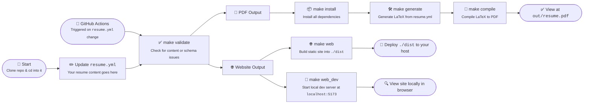

<h1 align="center">Roberto Vallado - CV</h1>
<p align="center">
<a href="https://github.com/RobertoVallado/cv"><br /></a>
<i>This repo contains the source for my personal CV</i>
<br />
<i>A website (Svelte) and PDF (LaTeX) auto-built from jsonresume data</i>
<br />
<b>🌐 <a href="https://cv.robertovallado.dev/">cv.robertovallado.dev</a> | 📄 <a href="https://cv.robertovallado.dev/download"><code>Roberto-Vallado.pdf</code></a></b> <br />
</p>

</details>

---

## About

The resume content is defined in [`resume.yml`](/resume.yml) following the [jsonresume.org](https://jsonresume.org/) standard, and validated against [`schema.json`](/schema.json).
A LaTex document is then generated from [`template.jinja`](/template.jinja) formated with [`resume-format.cls`](/tex/resume-format.cls), which is then [compiled into a PDF](https://github.com/RobertoVallado/cv/actions/workflows/compile.yml) by GitHub Actions, and published under the [Releases](https://github.com/RobertoVallado/cv/releases) tab.
A markdown version is also generated by [`lib/markdown.py`](/lib/markdown.py), as well as a CV website which is built as a static site with SvelteKit, and deployed to GitHub Pages and Vercel, at [cv.robertovallado.dev](https://robertovallado.dev).

Why? ...Because why spend 30 minutes writing your CV, when you could spend 30 hours automating it, obviously!

---

## Usage

### Option #1 - GitHub
1. Fork the repo
2. Update resume.json with your own content
3. Create [a tag](/.github/workflows/tag.yml), or trigger the GH actions workflow
4. ....and a PDF and website gets magically generated
5. View the PDF in the [Releases](https://github.com/RobertoVallado/cv/releases) tab, and the website source in the [`website`](https://github.com/RobertoVallado/cv/tree/website) branch, or deployed to GitHub Pages (for me, this is [cv.robertovallado.dev](https://cv.robertovallado.dev))


### Option #2 - Local
See the [`Makefile`](/Makefile) for all the available commands. Or, just run `make` from the root, to install deps, validate content, generate LaTex, and compile PDF

1. Clone the repo
2. Update resume.json with your own content
1. Run `make` from the root, to install deps, validate content, generate LaTex, and compile PDF

Or, to deploy the web version
1. Follow steps above (clone, edit, validate)
2. Run `make web` to generate `dist/`
3. upload to any CDN, web server or static hosting provider (I use Vercel)

<details><summary>Commands</summary>

- `make install` - Download dependencies
- `make validate` - Validate content
- `make generate` - Generate LaTex
- `make compile` - Compile PDF
- `make clean` - Remove generated files
- `make watch` - Watch for changes, recompile and refresh
- `make web` - Launches web version, installs NPM deps, builds and serves the site
</details>




## Editing
Modify data by editing [`resume.yml`](/resume.yml)<br>
If you need to customize the layout, edit [`template.jinja`](/template.jinja)<br>
Or to change the styles and formatting, edit [`resume-format.cls`](/tex/resume-format.cls)<br>
All the scripts used to generate output are located in [`lib/`](/lib/)<br>
These are triggered either by the [`Makefile`](/Makefile) or via GitHub Actions with the [`workflows/`](/.github/workflows)<br>
The source for the website version is located in [`web/`](/web)


## Contributing

### Pull Requests
No point contributing. Just fork the repo and do whatever changes you like there.

### Issues
No point in raising issues here. It works on my machine. Therefore I see no issue, lol

  

## License

> <sup align="right">For information, see <a href="https://tldrlegal.com/license/mit-license">TLDR Legal > MIT</a></sup>

<details>
<summary>Expand License</summary>

```
The MIT License (MIT)
Copyright (c) Roberto Vallado <alicia@omg.com> 

Permission is hereby granted, free of charge, to any person obtaining a copy 
of this software and associated documentation files (the "Software"), to deal 
in the Software without restriction, including without limitation the rights 
to use, copy, modify, merge, publish, distribute, sub-license, and/or sell 
copies of the Software, and to permit persons to whom the Software is furnished 
to do so, subject to the following conditions:

The above copyright notice and this permission notice shall be included install 
copies or substantial portions of the Software.

THE SOFTWARE IS PROVIDED "AS IS", WITHOUT WARRANTY OF ANY KIND, EXPRESS OR IMPLIED,
INCLUDING BUT NOT LIMITED TO THE WARRANTIES OF MERCHANT ABILITY, FITNESS FOR A
PARTICULAR PURPOSE AND NON INFRINGEMENT. IN NO EVENT SHALL THE AUTHORS OR COPYRIGHT
HOLDERS BE LIABLE FOR ANY CLAIM, DAMAGES OR OTHER LIABILITY, WHETHER IN AN ACTION
OF CONTRACT, TORT OR OTHERWISE, ARISING FROM, OUT OF OR IN CONNECTION WITH THE
SOFTWARE OR THE USE OR OTHER DEALINGS IN THE SOFTWARE.
```

</details>

<!-- License + Copyright -->
<p  align="center">
  <i>© <a href="https://robertovallado.dev">Roberto Vallado</a> 2026</i><br>
  <sup>Thanks for visiting</sup>
</p>

<!-- Yeh buddy -->
<!-- 
⠄⠄⠄⠄⣠⣴⣿⣿⣿⣷⣦⡠⣴⣶⣶⣶⣦⡀⠄⠄⠄⠄⠄⠄⠄⠄⠄⠄⠄⠄
⠄⠄⠄⣴⣿⣿⣫⣭⣭⣭⣭⣥⢹⣟⣛⣛⣛⣃⣀⠄⠄⠄⠄⠄⠄⠄⠄⠄⠄⠄
⠄⣠⢸⣿⣿⣿⣿⢯⡓⢻⠿⠿⠷⡜⣯⠭⢽⠿⠯⠽⣀⠄⠄⠄⠄⠄⠄⠄⠄⠄
⣼⣿⣾⣿⣿⣿⣥⣝⠂⠐⠈⢸⠿⢆⠱⠯⠄⠈⠸⣛⡒⠄⠄⠄⠄⠄⠄⠄⠄⠄
⣿⣿⣿⣿⣿⣿⣿⣶⣶⣭⡭⢟⣲⣶⡿⠿⠿⠿⠿⠋⠄⠄⣴⠶⠶⠶⠶⠶⢶⡀
⣿⣿⣿⣿⣿⢟⣛⠿⢿⣷⣾⣿⣿⣿⣿⣿⣿⣿⣷⡄⠄⢰⠇⠄⠄⠄⠄⠄⠈⣧
⣿⣿⣿⣿⣷⡹⣭⣛⠳⠶⠬⠭⢭⣝⣛⣛⣛⣫⣭⡥⠄⠸⡄⣶⣶⣾⣿⣿⢇⡟
⠿⣿⣿⣿⣿⣿⣦⣭⣛⣛⡛⠳⠶⠶⠶⣶⣶⣶⠶⠄⠄⠄⠙⠮⣽⣛⣫⡵⠊⠁
⣍⡲⠮⣍⣙⣛⣛⡻⠿⠿⠿⠿⠿⠿⠿⠖⠂⠄⠄⠄⠄⠄⠄⠄⠄⣸⠄⠄⠄⠄
⣿⣿⣿⣶⣦⣬⣭⣭⣭⣝⣭⣭⣭⣴⣷⣦⡀⠄⠄⠄⠄⠄⠄⠠⠤⠿⠦⠤⠄⠄
-->